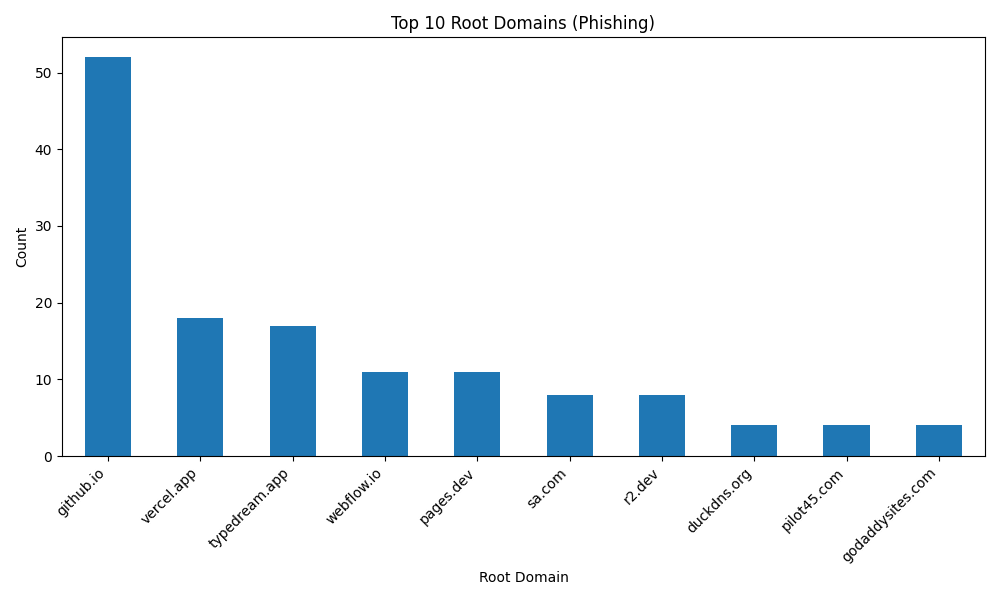
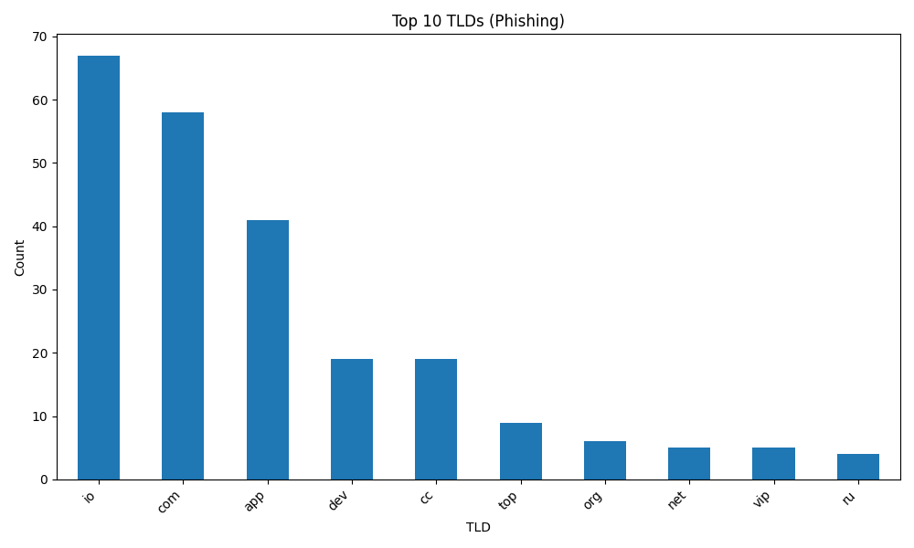

# Phishing URL Analysis Report

- Total URLs Collected: **299**

## Top 10 Root Domains

| root_domain      |   count |
|:-----------------|--------:|
| github.io        |      52 |
| vercel.app       |      18 |
| typedream.app    |      17 |
| webflow.io       |      11 |
| pages.dev        |      11 |
| sa.com           |       8 |
| r2.dev           |       8 |
| duckdns.org      |       4 |
| pilot45.com      |       4 |
| godaddysites.com |       4 |

## Top 10 TLDs

| tld   |   count |
|:------|--------:|
| io    |      67 |
| com   |      58 |
| app   |      41 |
| dev   |      19 |
| cc    |      19 |
| top   |       9 |
| org   |       6 |
| net   |       5 |
| vip   |       5 |
| ru    |       4 |

